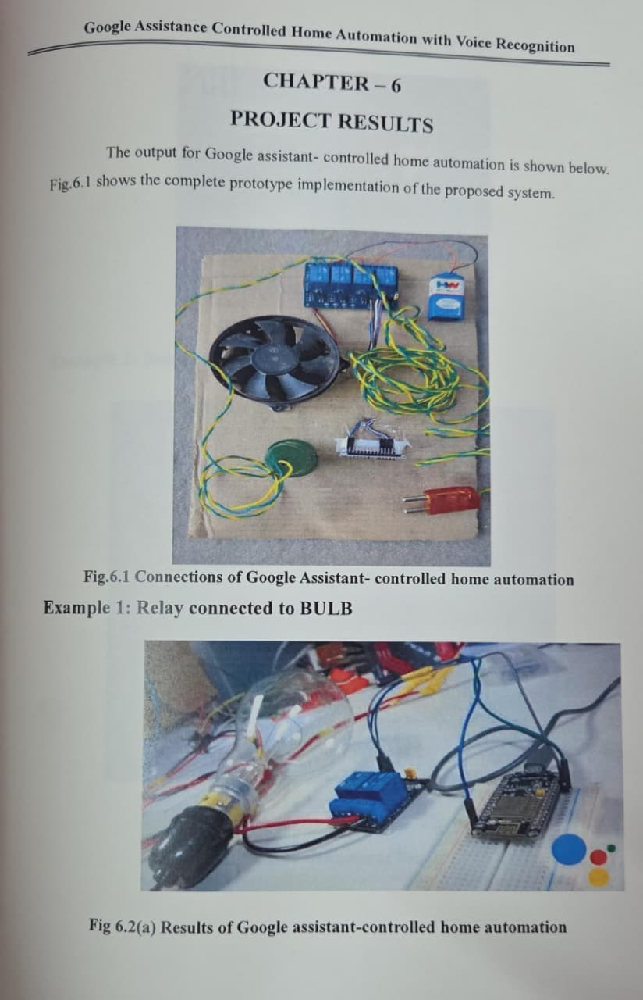

# Google Assistant Controlled Home Automation with Voice Recognition

## Overview
This project is an IoT-based home automation system that enables users to control home appliances using voice commands through Google Assistant.

## Technologies Used
- NodeMCU ESP8266
- Google Assistant
- IFTTT
- Adafruit IO
- Relay Module
- Embedded C

## Features
- Voice controlled appliance operation
- Remote access through internet connectivity
- Real-time device control
- Smart home automation

## Components
- NodeMCU
- Relay Module
- Bulb
- Fan
- Power Supply

## Outcome
Successfully implemented a voice-controlled home automation system for controlling electrical appliances remotely.
## Project Images

### Hardware Setup

### Fan Control

